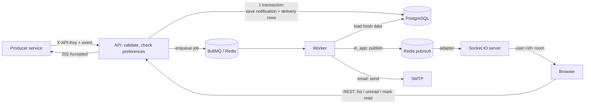
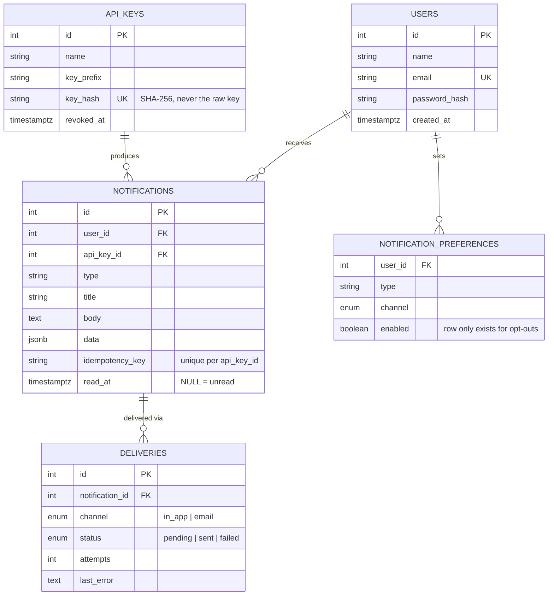

# Real-Time Notification System

A backend that lets trusted services fire events (`order_shipped`, `new_comment`, etc.) and delivers them to users **in real time over WebSockets** with **email as a durable second channel**, backed by a queue with retries, idempotent delivery, and per-user preferences. Built with Node.js, Express, PostgreSQL, BullMQ, Redis, and Socket.IO.

## Features

- **Two identity types with least privilege**: users authenticate with JWT and can only touch their own notifications; producing services authenticate with a hashed API key and can only submit events
- **Persist-before-promise ingestion**: every event is saved to Postgres and queued in one transaction before the API replies, so nothing is lost even if the queue write fails
- **Idempotent at three layers**: an `Idempotency-Key` header prevents duplicate notifications from a retried request, a fixed BullMQ `jobId` prevents duplicate jobs, and per-channel delivery rows prevent a retried job from double-sending
- **Real background processing**: a separate worker process delivers notifications with automatic retries and exponential backoff, decoupled from the API entirely
- **True real-time push**: Socket.IO with JWT handshake auth, per-user rooms, and a Redis adapter/emitter bridge so the worker (a different process) can push straight to a connected browser
- **A durable REST inbox** as the source of truth: unread counts, pagination, mark-as-read, for anyone who was offline when a notification fired
- **Per-user, per-type, per-channel preferences**, resolved server-side into a ready-to-render matrix
- Input validation, rate limiting (including a per-API-key budget for producers), secure headers, CORS allow-listing, and structured logs with sensitive headers redacted

## Tech stack

| Area | Choice |
|---|---|
| Runtime / framework | Node.js (ES modules), Express |
| Database | PostgreSQL via `pg` (raw SQL, no ORM) |
| Queue / background jobs | BullMQ on Redis (Upstash) |
| Real-time | Socket.IO + `@socket.io/redis-adapter` / `redis-emitter` |
| Auth | `jsonwebtoken`, `bcryptjs`, SHA-256-hashed API keys |
| Email | Nodemailer (Ethereal in development) |
| Validation | `zod` |
| Security | `helmet`, `cors`, `express-rate-limit` |
| Logging | `pino`, `pino-http` (with header redaction) |

## Architecture

### Two processes, one codebase

```
index.js   → API + Socket.IO server   (accepts events, serves the inbox, holds live connections)
worker.js  → background worker        (processes the queue, sends emails, pushes to sockets)
```

They share the same `src/` code but run independently. A slow or crashing email send can never freeze the connections serving your users, and either process can be restarted or scaled without touching the other.

### End-to-end event flow



The database is the guarantee; the socket is the fast path. A notification is never lost even if a user is offline or the live push fails — it's always waiting in the REST inbox.

### Project structure

```
notification-system/
├── db/
│   └── schema.sql
├── scripts/
│   ├── checkConnections.js
│   ├── createApiKey.js
│   ├── queueStatus.js
│   └── socketTest.js
├── src/
│   ├── config/          env.js, db.js, redis.js, mailer.js
│   ├── controllers/     auth, event, notification, preference
│   ├── services/        auth, apiKey, event, notification, preference
│   │   └── delivery/    inApp.delivery.js, email.delivery.js
│   ├── workers/          notification.worker.js   (the job processor)
│   ├── queues/           notification.queue.js    (adds jobs)
│   ├── sockets/          index.js                 (Socket.IO setup, auth, rooms)
│   ├── middleware/       auth (JWT), apiKey, validate, rateLimit, logger, error
│   ├── routes/           auth, event, notification, preference, health
│   ├── validators/       zod schemas per resource
│   └── app.js
├── index.js              // API + Socket.IO
├── worker.js              // background worker
└── package.json
```

## Data model



The full schema, with every constraint and index, is in [`db/schema.sql`](db/schema.sql).

## Getting started

### Prerequisites

- Node.js 20+
- A PostgreSQL database
- A [Upstash](https://upstash.com) Redis database — copy the **TCP/`rediss://`** connection string, not the REST URL
- A free [Ethereal](https://ethereal.email) account for development email

### Setup

```bash
git clone <your-repo-url>
cd notification-system
npm install
cp .env.example .env        # fill in the values below
psql "<your-database-uri>" -f db/schema.sql
npm run create:key -- "orders-service"   # copy the printed key, shown only once
npm run check                            # verifies Postgres and Redis are reachable
```

Then run the two processes, each in its own terminal:
```bash
npm run dev          # API + Socket.IO, http://localhost:4001
npm run dev:worker   # background worker
```

### Environment variables

| Variable | Description |
|---|---|
| `PORT` | API port, default `4001` |
| `DATABASE_URI` | PostgreSQL connection string |
| `REDIS_URL` | Upstash's **TCP** connection string (`rediss://...`), not the REST URL |
| `JWT_SECRET` | Long random string, at least 16 characters |
| `JWT_EXPIRES_IN` | Token lifetime, default `7d` |
| `CORS_ORIGINS` | Comma-separated allowed frontend origins (used by both HTTP CORS and the Socket.IO CORS config) |
| `SMTP_HOST` / `SMTP_PORT` / `SMTP_USER` / `SMTP_PASS` | From your Ethereal account |
| `MAIL_FROM` | From address used on outgoing mail |
| `NODE_ENV` | Set to `production` when deployed; otherwise logs are pretty-printed via the `pino-pretty` dev dependency |
| `LOG_LEVEL` | Optional, default `info` |
| `TRUST_PROXY` | Set to `1` when deployed behind a reverse proxy |

Startup validates these with `zod` and refuses to boot with a clear list of what's missing, rather than failing confusingly later.

### Scripts

| Command | What it does |
|---|---|
| `npm run dev` / `npm run dev:worker` | Start the API or the worker, with file watching |
| `npm start` / `npm run start:worker` | Start normally (production) |
| `npm run check` | Verify Postgres and Redis are reachable |
| `npm run create:key -- "name"` | Mint a new producer API key (shown once) |
| `npm run queue:status` | Print current job counts (waiting, active, completed, failed) |
| `npm run test:socket -- <jwt>` | Connect a test client and print notifications as they arrive live |

## API reference

All errors return `{ "error": "message" }`. User routes need `Authorization: Bearer <jwt>`. Producer routes need `X-API-Key: <key>`. The two credential types are strictly separated — neither opens the other's routes.

**Auth**

| Method | Path | Access | Notes |
|---|---|---|---|
| POST | `/api/auth/register` | Public | `name`, `email`, `password` (8–72 chars) |
| POST | `/api/auth/login` | Public | Same error for wrong password and unknown email |
| GET | `/api/auth/me` | User | |

**Events** (producers)

| Method | Path | Access | Notes |
|---|---|---|---|
| GET | `/api/events/whoami` | API key | Confirms a key is valid |
| POST | `/api/events` | API key | `userId`, `type`, `title`, `body`, optional `data`. Optional `Idempotency-Key` header. Returns `202` on new work, `200` if suppressed by preferences or replayed |

**Notifications** (users)

| Method | Path | Access | Notes |
|---|---|---|---|
| GET | `/api/notifications` | User | Query: `unread`, `page`, `limit` |
| GET | `/api/notifications/unread-count` | User | |
| PATCH | `/api/notifications/:id/read` | User (owner) | Idempotent — repeat calls are a no-op, not an error |
| PATCH | `/api/notifications/read-all` | User | |

**Preferences** (users)

| Method | Path | Access | Notes |
|---|---|---|---|
| GET | `/api/preferences` | User | Resolved matrix, only for types the user has already received |
| PUT | `/api/preferences` | User | `type`, `channel`, `enabled`. Setting `enabled: true` clears the override rather than storing it |

**Health**

| Method | Path |
|---|---|
| GET | `/api/health` — reports Postgres and Redis status; `503` if either is down |

### Real-time connection

Connect with Socket.IO, passing the JWT in the handshake (not the URL):

```javascript
import { io } from "socket.io-client";

const socket = io("http://localhost:4001", { auth: { token: jwt } });
socket.on("notification:new", (payload) => {
  // { id, type, title, body, data, createdAt }
});
```

Each connection joins a `user:<id>` room derived only from the verified token. A push here is best-effort — it has no delivery guarantee — so the REST inbox is what a client should reconcile against on reconnect.

### Example: ingesting an event

```bash
curl -X POST http://localhost:4001/api/events \
  -H "X-API-Key: nk_..." \
  -H "Content-Type: application/json" \
  -H "Idempotency-Key: order-482-shipped" \
  -d '{"userId":1,"type":"order_shipped","title":"Your order shipped","body":"Order #482 is on its way","data":{"orderId":482}}'
```
```json
{ "status": "queued", "notificationId": 7, "channels": ["in_app", "email"], "duplicate": false }
```
Replaying the identical request returns `"duplicate": true` with the same `notificationId` instead of creating a second notification.

### Status codes

| Code | Meaning |
|---|---|
| 400 | Validation failed, bad idempotency key length |
| 401 | Missing/invalid JWT or API key, wrong login credentials |
| 403 | CORS origin rejected |
| 404 | Not found, or not yours (notification, recipient user) |
| 409 | Duplicate account, or an idempotency key reused with a different event |
| 413 | Body too large |
| 429 | Rate limit exceeded (per-IP or per-API-key) |
| 503 | Notification saved but the queue write failed — safe to retry with the same idempotency key |
| 500 | Unexpected error (logged in full, hidden from the client) |

## Design decisions

**Persist before you promise.** The API saves the notification and its per-channel delivery rows in one transaction *before* enqueueing a job, and only replies once both the DB write and the enqueue succeed. If the enqueue fails after the DB commit, the API returns `503` and the notification survives — a retry with the same idempotency key detects the stuck `pending` deliveries and re-queues them, so a mid-request crash never loses data, only delays the fast path.

**Idempotency at three separate layers, each guarding a different failure.** An `Idempotency-Key` header, backed by a `UNIQUE` constraint, stops a producer's retried HTTP request from creating a second notification. A fixed BullMQ `jobId` (`notification-<id>`) stops the same notification from being queued twice. Per-channel `deliveries` rows, checked before each send, stop a retried *job* from re-sending a channel that already succeeded — this is what makes whole-job retries simple and safe rather than needing separate per-channel retry logic.

**Two credential types instead of a roles column.** Users prove identity with a password and get a JWT; producing services get a long random API key, shown once and stored only as a SHA-256 hash. A fast hash is correct here (unlike bcrypt for passwords) because the key's entropy, not the hash's slowness, is what prevents guessing. The two credential types open completely disjoint sets of routes, so a leaked API key can never read a user's inbox and a stolen user token can never inject events.

**Job-level retry, channel-level idempotency.** Rather than retrying each failed channel independently, the whole delivery job is retried on any channel failure, with BullMQ's exponential backoff (5 attempts, roughly 2s/4s/8s/16s apart). This is only safe because each channel checks and skips work already marked `sent` — so a retry after a partial failure re-attempts only what actually failed, at negligible cost.

**The database is the guarantee; the socket is the fast path.** A live push over Socket.IO has no delivery acknowledgment — there's no way to know a browser was listening. So delivery to the `in_app` channel is considered successful once published, and the REST inbox (built from the same `notifications` table) is the actual source of truth a client reconciles against on load or reconnect.

**Two processes need a message bus to talk about sockets.** The worker that decides to push a notification has no reference to the Socket.IO server, because it's a separate Node process. `@socket.io/redis-emitter` lets the worker publish to Redis without knowing who's listening; `@socket.io/redis-adapter` in the API process subscribes and delivers to any matching connected socket. This also means the API can already run as multiple instances behind a load balancer with no further changes — the adapter was solving cross-process delivery from day one, not just horizontal scaling.

**Handshake-time authentication, not per-message.** A JWT is verified once in `io.use()`, before a connection is even accepted, and the resulting user id is attached to the socket — never trusted from anything the client sends afterward. Sockets join a room named after that id, so a user's multiple open tabs or devices all receive the same broadcast for free, and one user's traffic can never reach another's socket.

**Preferences store only the exception, and resolve server-side.** A missing preference row means "enabled" by default, so brand-new notification types work without any setup. `GET /api/preferences` doesn't expose that raw convention — it returns a fully resolved true/false matrix per type and channel, so a frontend never has to reimplement the default-is-enabled logic itself.

**Fail fast, everywhere.** Environment variables are validated with `zod` at startup. Both `index.js` and `worker.js` verify their dependencies — Postgres, Redis, and (for the worker) SMTP credentials — before accepting any work, so a misconfiguration is caught in the terminal, not on a user's first request.

## Known limitations and next steps

- **No automated tests yet.** Every endpoint, the worker's retry and backoff behavior, and the socket flow have been tested manually and deliberately, including forcing real Redis and SMTP outages. Vitest and Supertest are the natural next step.
- **At-least-once, not exactly-once, delivery.** If the worker process crashes after successfully sending an email but before its `UPDATE ... SET status = 'sent'` commits, a retry will resend that email. This is an inherent tradeoff of distributed queues, not a bug — genuinely exactly-once delivery would need a two-phase commit between the mail server and Postgres, which isn't practical here.
- **Preferences require having received the type at least once.** There's no registry of valid event types, since they're producer-defined free text; a preferences UI can only show toggles for types a user has already seen.
- **Rate limiter counters live in memory** and reset on restart; a Redis-backed store would be needed across multiple instances.
- **No queue observability dashboard.** [Bull Board](https://github.com/felixmosh/bull-board) would be a small addition for inspecting jobs visually instead of via `queue:status`.
- **No native mobile push.** In-app (WebSocket) and email are the two channels; SMS or APNs/FCM push would be additional channel modules following the same `deliverX(notification)` contract as `email.delivery.js`.